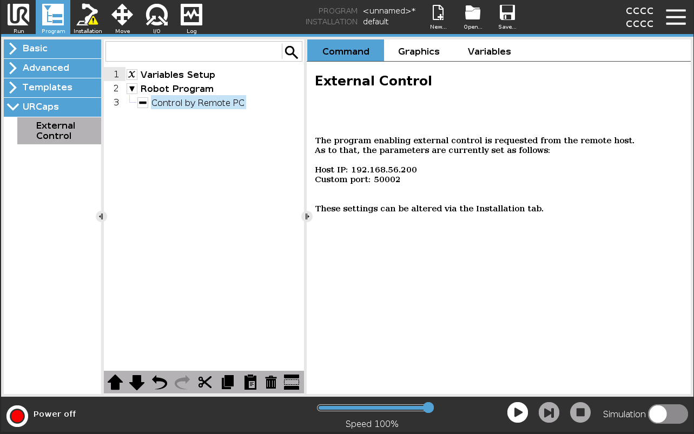

# Interface ROS2 UR5

Feito: No

# Tutorial

## 1. Pré-requisitos

- Docker deve estar instalado
- Git deve estar instalado

## 2. Starting the environment

Clone o repositório:

```bash
git clone https://github.com/pla10/ros2_ur5_interface.git
```

Entre no repositório:

```bash
cd ros2_ur5_interface
```

Crie uma subrede com o *docker network:*

```bash
docker network create --subnet=192.168.56.0/24 ursim_net
```

Torne os scripts da pasta scripts executáveis:

```bash
chmod +x scripts/ur5.sh
chmod +x scripts/ros2.sh
```

Rode o primeiro o *ur5.sh*

```bash
scripts/ur5.sh
```

Ele levanta um serviço no [localhost](http://localhost) na porta 6080, abra o navegador e entre no endereço 0.0.0.0:6080, ou localhost:6080, ou 127.0.0.1:6080. Acesse a interface, entre na aba de *program* (canto superior esquerdo), acesse a opção URCaps, Clique em External Control.



Rode o script *ros2.sh*

```bash
scripts/ros2.sh
```

Acesse o endereço 0.0.0.0:6081, ou localhost:6081, ou 127.0.0.1:6081. 


## 3. Rodando o Gazebo e Lendo as images

### 3.1 Configurando arquivos

```bash
cd ~/ros2_ws/src
ros2 pkg create image_subscriber --build-type ament_python
cd image_subscriber
```

Edit `package.xml`:

```bash
<?xml version="1.0"?>
<?xml-model href="http://download.ros.org/schema/package_format3.xsd" schematypens="http://www.w3.org/2001/XMLSchema"?>
<package format="3">
  <name>image_subscriber</name>
  <version>0.0.0</version>
  <description>TODO: Package description</description>
  <maintainer email="ubuntu@todo.todo">ubuntu</maintainer>
  <license>TODO: License declaration</license>

  <test_depend>ament_copyright</test_depend>
  <test_depend>ament_flake8</test_depend>
  <test_depend>ament_pep257</test_depend>
  <test_depend>python3-pytest</test_depend>
  <exec_depend>rclpy</exec_depend>
  <exec_depend>sensor_msgs</exec_depend>
  <exec_depend>cv_bridge</exec_depend>
  <exec_depend>opencv</exec_depend>
  <exec_depend>python-opencv</exec_depend>

  <export>
    <build_type>ament_python</build_type>
  </export>
</package>
```

1. Create a directory for your Python scripts:

```bash
mkdir -p image_subscriber
```

1. Create a file named `image_subscriber.py` in the `image_subscriber` directory with the code you provided.

```bash
import rclpy
from rclpy.node import Node
from sensor_msgs.msg import Image
from cv_bridge import CvBridge
import cv2

class ImageSubscriber(Node):
    def __init__(self):
        super().__init__('image_subscriber')
        self.subscription = self.create_subscription(
                    Image,
                    '/camera/image_raw/image',
                    self.listener_callback,
                    10)
        self.bridge = CvBridge()

    def listener_callback(self, msg):
        try:
            cv_image = self.bridge.imgmsg_to_cv2(msg, "bgr8")
            cv2.imshow("Image", cv_image)
            cv2.waitKey(1)
        except Exception as e:
            self.get_logger().error('Error converting image: %s' % str(e))

def main(args=None):
    rclpy.init(args=args)
    image_subscriber = ImageSubscriber()
    rclpy.spin(image_subscriber)
    image_subscriber.destroy_node()
    rclpy.shutdown()

if __name__ == "__main__":
    main()
```

1. Make the script executable:

```bash
chmod +x image_subscriber/image_subscriber.py
```

**Edit `setup.py`**

```bash
from setuptools import find_packages, setup
package_name = 'image_subscriber'

setup(

    name=package_name,
    version='0.0.0',
    packages=find_packages(exclude=['test']),
    data_files=[
        ('share/ament_index/resource_index/packages',
            ['resource/' + package_name]),
        ('share/' + package_name, ['package.xml']),
    ],

    install_requires=['setuptools'],
    zip_safe=True,
    maintainer='ubuntu',
    maintainer_email='ubuntu@todo.todo',
    description='TODO: Package description',
    license='TODO: License declaration',
    tests_require=['pytest'],
    entry_points={
        'console_scripts': [
            'image_subscriber = image_subscriber.image_subscriber:main',
        ],
    },
)
```

### 3.2 Build Script

```bash
cd ~/ros2_ws
colcon build --packages-select image_subscriber

```

### 3.3 Run Script

In one terminal run

```bash
ros2 launch ros2_ur5_interface sim.launch.py
```

Open another terminal and run

```bash
ros2 run ros2_ur5_interface publish_trajectory_node 
```

In another terminal, run your script:

```bash
ros2 run image_subscriber image_subscriber 
```

### 3.4 Troubleshooting

If there is an error relative to the Numpy version, try to downgrade it

```bash
pip install numpy==1.26.4 --break-system-packages 
```

Rebuilding the script in case of broken code

```bash
cd ~/ros2_ws
colcon build --packages-select image_subscriber --cmake-clean-first
colcon build --packages-select image_subscriber
source install/setup.bash
```

### 3.5 Extra

arquitetura de diretórios

```bash
ros2_ws/
└── src/
    └── image_subscriber/
        ├── image_subscriber/
        │   ├── __init__.py
        │   └── image_subscriber.py
        ├── package.xml
        ├── setup.py
        └── setup.cfg
  
```

## 3.6 !!! IMPORTANTE !!!

O Dockerfile já contem o pacote *image_subscriber*, é necessário apenas buildar o pacote (tópico 3.2)

## 4 Compartilhando topic para máquinas na mesma rede

Suponha que você tenha duas máquinas em endereços IPs diferentes (192.168.56.100, e 192.168.56.200, por exemplo). Em uma das máquinas (192.168.56.200), você está rodando uma simulação do ros2. Para que a máquina 192.168.56.100 tenha acesso aos tópicos da máquina 192.168.56.200, use o seguinte comando em ambas as máquinas

```bash
export ROS_DOMAIN_ID=42
```

Você pode verificar que as máquinas compartilham os mesmos tópicos usando o seguinte comando em ambas 

```bash
ros2 topic list
```

Para testar rode o comando

```bash
ros2 run demo_node_cpp talker
```

Na máquina 192.168.56.200 e na máquina 192.168.56.100 rode 

```bash
ros2 run demo_node_cpp listener
```

## 5 Compartilhando Tópicos Entre Máquinas em Redes Distintas

Suponha a seguinte topologia


A solução utilizando o ROS_DOMAIN_ID já não funciona, pois os containers rodando as aplicações ROS estão em redes diferentes. *Mas não priemos cânico*, pois há uma solução igualmente simples utilizando o Zenoh.

### 4.1 Explicando a Topologia

Essa topologia utiliza 3 VMs, duas servem como host para containers docker, cada uma dessas duas VMs estão em redes isoladas, a terceira VM serve como switch que conecta ambas as redes. Os respectivos endereços IP estão disponíveis na imagem acima.

### 4.2 Utilizando o Zenoh

Com a configuração padrão, o zenoh é capaz de realizar a mediação entre publishers e subscribers dentro de uma máquina local. Entretanto, alterando o arquivo de configuração, DEFAULT_RMW_ZENOH_ROUTER.json5, disponibilizado [aqui](https://github.com/ros2/rmw_zenoh/tree/rolling/rmw_zenoh_cpp/config).

### 4.3 Passo a Passo

*Vou assumir que você sabe como criar a topologia mencionada acima.*

1. Utilize o código [deste](https://github.com/JoaoGabrielTN/ROS2-ORANOR.git) respositório para o tutorial.
2. Nas VMs com endereço 192.168.100.200 e 192.168.50.200 clone o repositório e builde a imagem docker

```bash
git clone https://github.com/JoaoGabrielTN/ROS2-ORANOR.git
cd ROS2-ORANOR
docker build -t ros2-jazzy-teste .
```

 3. Inicie o container em cada VM

```bash
scripts/scripts/ros2_im_read.sh                                                                                                                        ✔  23s  
```

*Fiz o favor de instalar o tmux na imagem, sugiro que você utilize 2 sessões em cada container para os proxímos passos.*

1. Configurando o container com o publisher (192.168.100.200)

```bash
# sessão 1
export RMW_IMPLEMENTATION=rmw_zenoh_cpp
ros2 run rmw_zenoh_cpp zenohd
# sessão 2
ros2 run demo_nodes_cpp talker
```

1. Configurando o container com o subscriber (192.168.50.200)

```bash
# sessão 1
export RMW_IMPLEMENTATION=rmw_zenoh_cpp
export ZENOH_ROUTER_CONFIG_URI=/ros2_ws/DEFAULT_RMW_ZENOH_ROUTER_CONFIG.json5
ros2 run rmw_zenoh_cpp zenohd
# sessão 2
ros2 run demo_nodes_cpp listener
```
